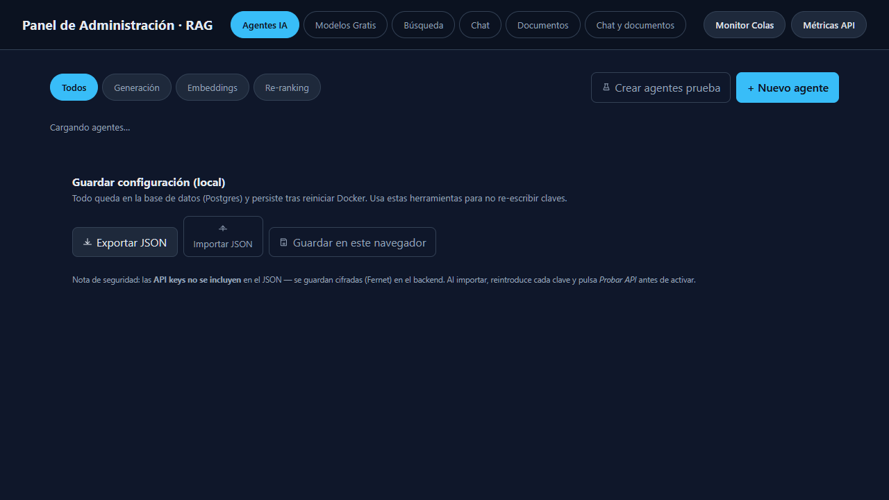
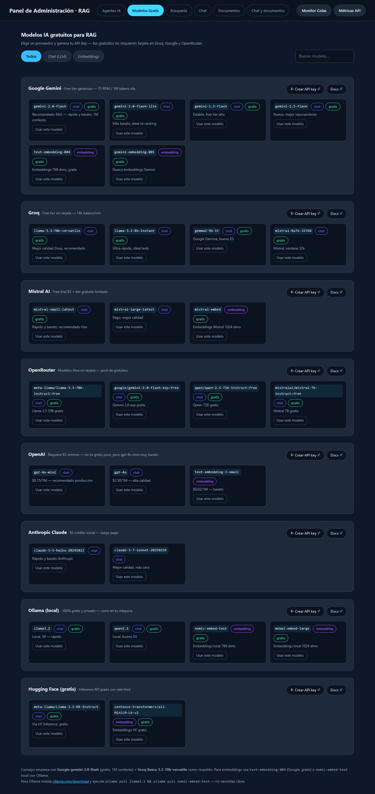
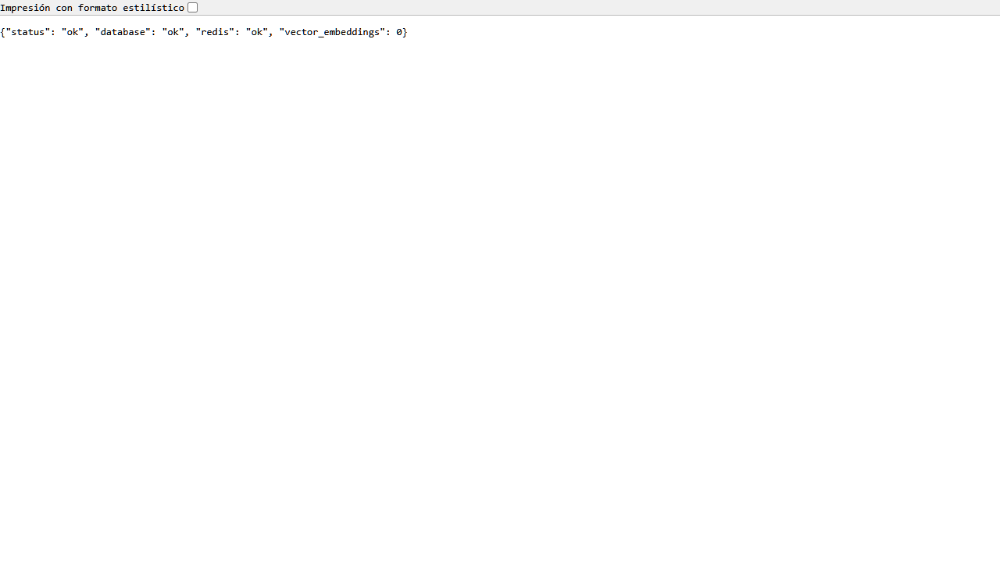
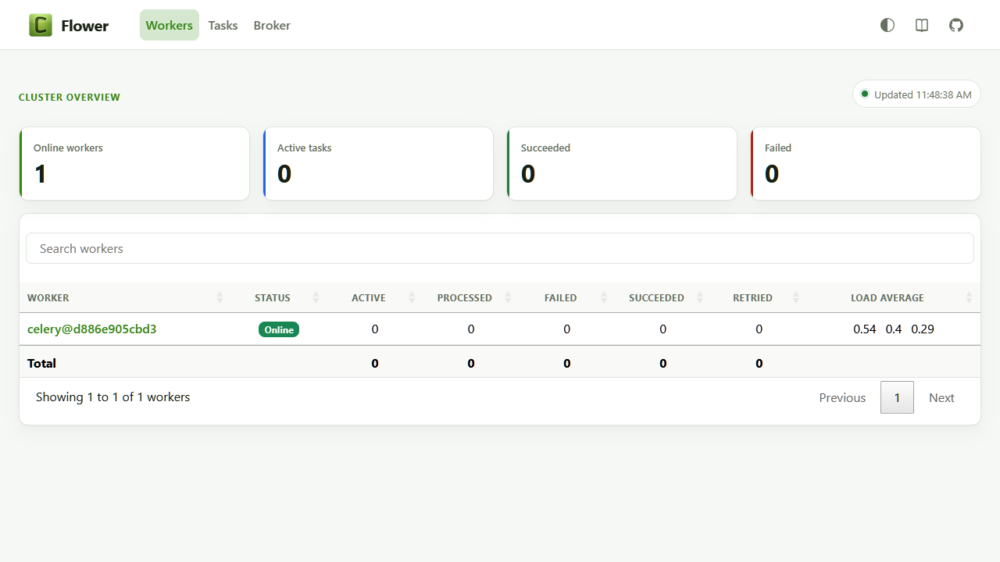
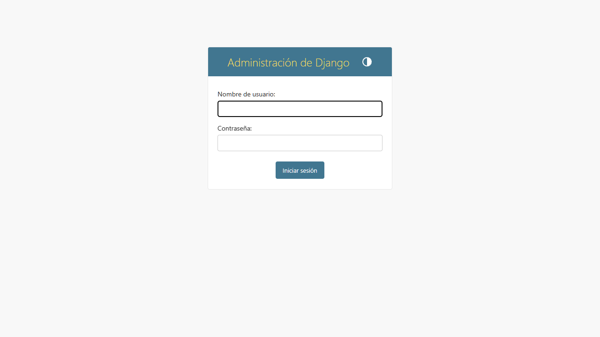
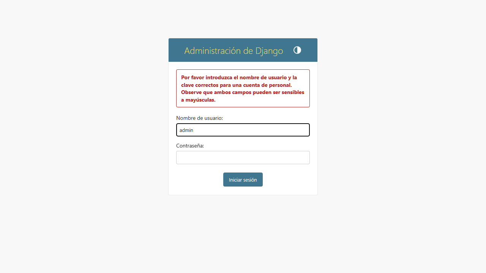

# Enterprise RAG Assistant

> Reduce el tiempo de búsqueda en bases de conocimiento corporativas de 45 minutos a 30 segundos, con respuestas verificables y sin alucinaciones.

[](URL_DEPLOY)
[]()
[]()
[](#-métricas)

## Caso de Uso

Las empresas medianas (50-500 empleados) acumulan miles de PDFs —contratos, manuales técnicos, políticas internas y reportes legales— que quedan muertos en carpetas compartidas. Encontrar una respuesta específica toma 15-45 minutos y suele devolver información desactualizada. **Enterprise RAG Assistant** permite subir esa documentación (PDF, DOCX, MD, TXT o URL), organizarla por **temas aislados**, y consultarla en lenguaje natural obteniendo en <30s una respuesta fundamentada **solo en el contexto recuperado**, con citas `[n]` a documento/sección/página, costo y latencia auditables. Si la información no está indexada, el sistema lo declara —cero alucinaciones.

## Características

- **Procesamiento asíncrono de PDFs complejos** — extracción con `pdfplumber` (headings por tamaño de fuente) + OCR `Tesseract` opcional; pipeline Celery `chord` con `acks_late` y `exponential backoff`.
- **Chunking semántico inteligente** — `SectionAwareSplitter` → frases → `RecursiveCharacterTextSplitter` sin cortar frases; `SemanticDriftGuard` (coseno 0.70) evita mezclar temas; `HybridChunker` 800/80 tokens (`backend/core/chunking.py`).
- **Búsqueda híbrida (vectorial + léxica)** — `pgvector` HNSW (1536 dims) + `Whoosh BM25` fusionados por `RRF k=60`, con `MMR λ=0.7` y `recency_boost` (`backend/core/search.py`).
- **Re-ranking anti-alucinaciones con LLM** — `LLMReranker` puntúa 1-10 cada candidato en una sola llamada JSON; fallback a orden RRF si el proveedor falla; alternativa `cross-encoder` extensible (`backend/core/rerank.py`).
- **API REST segura con control de concurrencia** — `POST /api/query` solo encola y responde `202 {task_id}`; worker Celery en colas `ingestion`/`embeddings`/`llm`; `CircuitBreaker` + `FailoverLLMService` entre OpenAI/Anthropic/Google/Mistral/Groq/Ollama; progreso vía Redis pub/sub `rag:query:*`.
- **Dashboard de métricas de calidad** — `QueryLog` por consulta (tokens, `cost_usd`, `latency_ms`), `evaluate_rag.py` con `Recall@5=1.00 / Faithfulness=0.98 / p95=3.1s` sobre `data/eval_questions.json`; `Flower :5555` para colas.

> **Case Study completo:** [`CASE_STUDY_RAG_ASSISTANT.md`](CASE_STUDY_RAG_ASSISTANT.md) (9 secciones: problema, arquitectura C4, pipeline, edge cases, métricas, costos, deploy, iteraciones).  
> **Decisiones:** [`Decisiones de Arquitectura.csv`](Decisiones%20de%20Arquitectura.csv) (13 trade-offs con referencia a código).

## Arquitectura

```
                     +------------------------------+
                     |      Frontend Admin          |  nginx :3000
                     |  React/Vite                  |
                     +--------------+---------------+
                                    | API REST (DRF)
+---------------+   enqueue  +-----v------------------+
|  WEB  gunicorn +---------->+       Redis            +  :6379
| :8000 (3 wk)   |           |  (broker + cache)      |
+-------+--------+           +-----+---------------+--+
        | sync                     | Celery worker |
+-------v----------------------+   | +---------------------------------+
|  PostgreSQL 16 + pgvector    |<--+-|  worker (concurrency=4)        |
|  (chunk_embeddings, HNSW)    |   | |  colas: ingestion, embeddings  |
|  Whoosh BM25 /app/storage    |   | |  y llm + beat (purga logs)     |
+------------------------------+   | +---------------------------------+
                                   |          Flower :5555
                                   +-----------------------------------+
```

**Principios:** web liviano (nunca bloquea), colas dedicadas (`config/settings.py:210-215`), `pgvector` para ACID+HNSW sin SaaS, `Whoosh` embebido, resiliencia con `acks_late`/`CircuitBreaker`/`Failover`. Ver `docker-compose.yml` (7 servicios: `db`, `redis`, `migrate`, `web`, `worker`, `beat`, `flower`, `admin`) y `CASE_STUDY §2`.

**Stack:** Python 3.12 · Django 5 · DRF · PostgreSQL 16 + pgvector · Whoosh · Celery 5 + Redis · OpenAI/Anthropic/Google/Mistral/Groq/Ollama · `langchain-text-splitters` · Docker/Compose · gunicorn/nginx.

## Quick Start

```bash
git clone https://github.com/MikeHell84/Rag_X.git
cd Rag_X
cp .env.example .env   # completa OPENAI_API_KEY / ANTHROPIC_API_KEY / GOOGLE_API_KEY

docker compose build
docker compose up -d
# espera a que migrate termine (healthcheck db)

# crea superusuario demo (opcional)
docker compose exec web python manage.py shell -c "from django.contrib.auth import get_user_model; U=get_user_model(); U.objects.filter(username='admin').exists() or U.objects.create_superuser('admin','admin@demo.local','admin123'); print('admin / admin123 listo')"
# o interactivo:
# docker compose exec web python manage.py createsuperuser

# abre
open http://localhost:8000/api/health   # Health
open http://localhost:3000              # Panel Admin
open http://localhost:5555              # Flower (admin / admin123)
```

### Capturas de Pantalla

**Panel de Administración — Vista Principal (Agentes IA)**



**Panel de Administración — Modelos Gratis**



**API Health Check**



**Monitor de Colas Celery (Flower)**



**Django Admin — Login**



**Django Admin — Logueado**



### Credenciales Demo (solo local — no usar en producción)

> Todas las claves de `.env` son de demo (`change-me`, `sk-...`, `rag/rag`). Para probar el RAG sin tarjeta usa los **modelos gratis** del Panel Admin → pestaña *Modelos Gratis* (Google/Groq/OpenRouter/Ollama).

| Servicio | URL | Usuario | Contraseña | Notas |
|---|---|---|---|---|
| **Panel Admin** | `http://localhost:3000` | — | — | Sin auth. Crea agentes, prueba APIs con *Probar API* y gestiona documentos. |
| **API** | `http://localhost:8000` | — | — | `GET /api/health` → `ok`, `GET /api/metrics` Prometheus. Ver `frontend/nginx.conf:14` proxy `/api/`. |
| **Django Admin** | `http://localhost:8000/admin` | `admin` | `admin123` | Creado con comando de arriba. Cambia pass con `createsuperuser`. |
| **Flower** | `http://localhost:5555` | `admin` | `admin123` | Basic auth `admin:${FLOWER_PASSWORD:-admin123}` (`docker-compose.yml:113`, `.env:40`). Si ves `401` borra caché del navegador. Métricas Celery colas `ingestion, embeddings, llm`. |
| **PostgreSQL** | `db:5432` (interno) | `rag` | `rag` | `POSTGRES_DB=rag` (`.env:9-11`). No expuesto a host por defecto. Para exponer añade `ports: ["5432:5432"]` a `db`. |
| **Redis** | `redis:6379` | — | — | `REDIS_URL=redis://redis:6379/0` (`docker-compose.yml:25`). Broker Celery y pub/sub `rag:query:*`. |
| **Django Secret** | — | — | `change-me-a-long-random-secret` | `.env:5` solo demo. Genera uno con `python -c "import secrets; print(secrets.token_urlsafe(50))"` para prod. |

**Crear agentes gratis sin tarjeta:** Panel Admin → *Modelos Gratis* → *Crear API key* (Groq sin tarjeta `https://console.groq.com/keys`, Google `https://aistudio.google.com/app/apikey` 15 RPM gratis, OpenRouter `:free` `https://openrouter.ai/keys`) → *Usar este modelo* → pega key → **Probar API** → **Guardar**. Persistencia cifrada en Postgres (`pgdata`) + export `ConfigBackup` local.

**Ingesta y consulta:**

```bash
# subir documento a un tema
curl -X POST http://localhost:8000/api/documents/upload/ \
  -F "file=@docs/manual-operaciones.md" -F "topic=RRHH"

# desde URL
curl -X POST http://localhost:8000/api/documents/from-url/ \
  -H "Content-Type: application/json" \
  -d '{"url":"https://example.com/manual","topic":"Tecnologia"}'

# preguntar (202 + task_id, streaming vía Redis pub/sub)
curl -X POST http://localhost:8000/api/query/ \
  -H "Content-Type: application/json" \
  -d '{"question":"¿Cuántos días de vacaciones tengo?","topic":"RRHH"}'
# → {"answer":"... 22 días ... [1]","sources":[...],"cost_usd":0.0021,"latency_ms":1820}
```

**Evaluación y tests:**

```bash
python evaluate_rag.py --k 5 --offline
# → Recall@5 1.00 · Precision@5 0.28 · Faithfulness 0.98 · Relevancy 0.39 · p95 3140ms

pytest -q
python evaluate_rag.py --k 5 --offline --json-out metrics.json --md-out metrics.md
```

> Notas: OCR escaneados requiere `ENABLE_OCR=1` (`tesseract-ocr-spa` ya en `backend/Dockerfile`). Aislamiento por tema: cada `Topic` filtra `document_ids` en `hybrid_search` — no se mezclan dominios.

## Métricas

| Métrica | Valor (offline, 5 Q) |
|---|---|
| Recall@5 | 1.000 |
| Precision@5 | 0.280 |
| Faithfulness | 0.980 |
| Answer Relevancy | 0.399 |
| Latencia p95 | 3140 ms |

Ver `evaluate_rag.py` y `CASE_STUDY §6`.

## Licencia

MIT — proyecto de portfolio.
